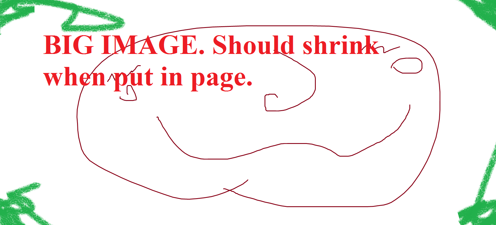

This is a test of the rendering of my css combined with Github pages markdown conversion. 
Note that github pages parses markdown using jekyll, which in turn uses [kramdown](https://kramdown.gettalong.org/quickref.html).
This works slightly different than github pages.

Following PHP markdown extra, Kramdown uses curly braces to add extra info to elements

~~~
Set an id by putting {:#idhere} after an element

Use {:.classname} to specify an elements class.

You can specify other attributes this way as well.
eg {: height="36px" width="36px"}

A simple paragraph with an ID attribute.
{: #para-one}

> A blockquote with a title
{:title="The blockquote title"}
{: #myid}

special span IAL {::} contains no attributes but doesn’t generate a warning either. It can be used to separate consecutive elements that would be falsely parsed if not separated

You can also tell it not to render a chunk of markdown using something like {::nomarkdown}**see**{:/}
~~~

# H1 header

## H2 header

### H3 header

#### H4 header

##### H5 header

###### H6 header

> A sample blockquote.
>
> >Nested blockquotes are
> >also possible.
>
> ## Headers work too
> This is the outer quote again.

> This is a blockquote
continued on this
and this line.

But this is a separate paragraph.

~~~~~~
This is also a code block.
~~~
Ending lines must have at least as
many tildes as the starting line.
~~~~~~~~~~~~

~~~ ruby
def what?
  42
end
~~~

-  -  -

## LISTS

1. This is a list item
2. And another item
2. And the third one
   with additional text
   
   
1.  This is a list item

    > with a blockquote

    # And a header

2.  Followed by another item

1. Item one
   1. sub item one
   2. sub item two
   3. sub item three
2. Item two

* Item one
+ Item two
- Item three

term
: definition
: another definition

another term
and another term
: and a definition for the term

* Item 1
  2. Item two nested
    * item three unordered
  * beans
    * toasts
      * eggs yeh
      
      
      
      
      
      
      
## Tables

| A simple | table |
| with multiple | lines|

| Header1 | Header2 | Header3 |
|:--------|:-------:|--------:|
| cell1   | cell2   | cell3   |
| cell4   | cell5   | cell6   |
|----
| cell1   | cell2   | cell3   |
| cell4   | cell5   | cell6   |
|=====
| Foot1   | Foot2   | Foot3
{: rules="groups"}

| Header1 | Header2 | Header3 |
|:--------|:-------:|--------:|
| cell1   | cell2   | cell3   |
| cell4   | cell5   | cell6   |
|----
| cell1   | cell2   | cell3   |
| cell4   | cell5   | cell6   |
|=====
| Foot1   | Foot2   | Foot3
{: rules="all"}

| Header1 | Header2 | Header3 |
|:--------|:-------:|--------:|
| cell1   | cell2   | cell3   |
| cell4   | cell5   | cell6   |
|----
| cell1   | cell2   | cell3   |
| cell4   | cell5   | cell6   |
|=====
| Foot1   | Foot2   | Foot3
{: rules="none"}

## Html elements

add markdown="block" or markdown="span" to make the contents render

Float right and no **markdown** rendering.

Float right and **markdown** rendering.

{:markdown="block"}

Click to expand or collapse

  And these are the contents inside of the details element
  
  Paragraph caused by *newlines*

<aside markdown="block">
  If things are set up right, this blurb will be rendered in the margins. 
  *But* if the page is too skinny, it will be rendered as a little bordered box.
</aside>

Right now, sections are set up to follow the basic.css example, and be rendered as flexboxes.

<section markdown="block"}>
  <section markdown="block"}>
    Ello *wee*
  </section>
  <section markdown="block"}>
    - potato
    - potahto
  </section>
  <section markdown="block"}>
    Follow your dreams
  </section>
</section>

And article is rendered as a litle card thingy.

<article markdown="block">
  ### Weee a card
  
  And let's put some stuff in it. $$x_2$$ and $$x_b$$
  
  And here's the more standard math inline  $x_2$ and $x_b$. Might break.
  
  $$x_a +y_b + \delta_k + z_{z_z}$$
</article>

Same thing but without markdown rendering

<article>
  ### Weee a card
  
  And let's put some stuff in it. $$x_2$$ and $$x_b$$
  
  And here's the more standard math inline  $x_2$ and $x_b$. Might break.
  
  $$x_a +y_b + \delta_k + z_{z_z}$$
</article>

I should probably change it to use classes for these things. A ".card", ".row", etc would work fine, That's apparently the standard for minimal css stuff like [this one](http://classless.de/)

## Span elements like text modifiers

Here's some **strong bold text** and here's some *emphasized italic text*.

Here's a a [link](http://kramdown.gettalong.org "title text goes here") to the kramdown homepage.

Links can also be defined via references like this: A link to the [kramdown hp].

[kramdown hp]: http://kramdown.gettalong.org "hp"

Here's an image: 

Inline code `like this` yeh

Footnotes are notstandard, but included in kramdown [^1].

[^1]: And here is the content of the footnote.

Abbriviations are also included in kramdown. This is an HTML example.

*[HTML]: Hyper Text Markup Language

This is written *in* red.

This is *red*{: style="color: red"}.

